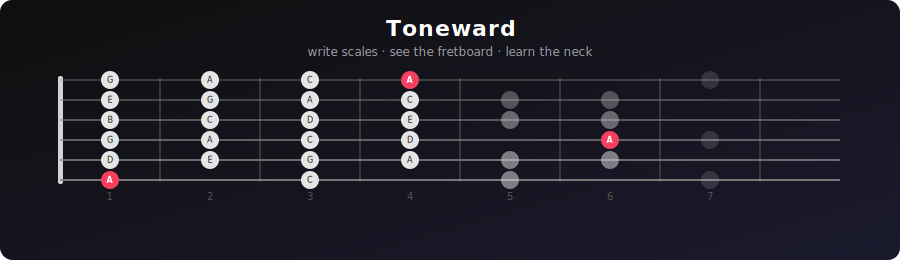

<div align="center">



<br/>

**A visual guitar fretboard tool for learning scales, intervals, and box patterns.**

Type notes or intervals in a simple text syntax. See them instantly on an interactive fretboard.

[](LICENSE)
[](https://react.dev)
[](https://www.typescriptlang.org)

</div>

---

## 🎯 How it works

Write notes or intervals in the editor and the fretboard updates in real time.

**🎵 Notes mode** — just list the notes:
```
C E G Bb
```

**🔢 Intervals mode** — set a root, then list intervals:
```
root: A
1 b3 4 5 b7
```

The fretboard shows every occurrence of those notes across the neck, with optional labels (note names, intervals, or none) and root highlighting.

## ✨ Features

- 🎹 **Two input modes** — absolute notes or intervals over a root
- 🏷️ **Toggleable labels** — show note names, interval numbers, or clean dots
- 🎯 **Root highlighting** — visually distinguish the tonic in red
- 📦 **Box patterns** — auto-generated positional patterns (2 or 3 notes per string)
- 🔎 **Adjustable fret range** — focus on any region of the neck
- 📋 **Copy to clipboard** — one click to copy the fretboard as an image

## 🚀 Getting started

```bash
pnpm install
pnpm dev
```

Open [http://localhost:5173](http://localhost:5173) in your browser.

## 🤖 Agent workflows

This project supports both Claude Code and Codex workflows.

Codex reads durable repo guidance from `AGENTS.md` and repo-scoped skills from `.agents/skills/`. GitHub comments posted by Codex must end with `— Codex`.

| Workflow | Claude usage | Codex usage | What it does |
|---|---|---|---|
| Work issue | `claude "/work-issue https://github.com/.../issues/42"` | `codex exec --sandbox workspace-write 'Use $work-issue to work issue #42'` | Works a GitHub issue end-to-end: claims it, creates a worktree, implements, validates, and opens a PR |
| PR | `claude "/pr"` | `codex exec --sandbox workspace-write 'Use $pr'` | Creates or updates a pull request for the current branch |
| Commit | `claude "/commit"` | `codex exec --sandbox workspace-write 'Use $commit'` | Stages changes and writes a conventional commit message |
| Review issues | `claude "/review-issues"` | `codex exec --sandbox workspace-write 'Use $review-issues'` | Triages open issue comments and acts on clear feedback autonomously |
| Address review | `claude "/address-review 10"` | `codex exec --sandbox workspace-write 'Use $address-review for PR #10'` | Reads PR review comments, applies fixes, and re-requests review |
| New issue | `claude "/new-issue Add dark mode"` | `codex exec --sandbox workspace-write 'Use $new-issue to file: Add dark mode'` | Creates a GitHub issue with automatic type/size classification |
| Code review | `claude "/code-review"` | `codex exec 'Use $code-review to review the current diff'` | Reviews the current diff for bugs, security, and code quality |

Autonomous Codex queue runner:

```bash
scripts/codex/run-next-issue.sh
```

It uses agent-neutral `automation:*` labels by default (`automation:ready`, `automation:in-progress`, `automation:review`, `automation:revise`, `automation:blocked`, `automation:completed`) and creates worktrees under `.agents/worktrees/`.

Useful Codex setup checks:

- Run `/skills` and confirm the repo skills appear.
- Run `/hooks` and trust the project hooks if prompted.
- Run `/mcp` to confirm external tools. GitHub access is useful for issue/PR workflows, Context7 is useful for current library docs, and Playwright or Chrome DevTools MCP is useful for browser/UI inspection.

## 📖 Input syntax

| Input | Mode | Result |
|---|---|---|
| `C E G` | Notes | C major triad on the fretboard |
| `root: G`<br>`1 b3 5 b7` | Intervals | G minor 7 arpeggio |
| `root: A`<br>`1 2 3 5 6` | Intervals | A major pentatonic scale |
| `root: E`<br>`1 b3 4 5 b7` | Intervals | E minor pentatonic scale |

**Supported intervals:** `1` `b2` `2` `b3` `3` `4` `b5` `5` `#5` `6` `b7` `7`

**Accepted note formats:** sharps (`C#`, `F#`) and flats (`Db`, `Bb`, `Eb`)

## 🛠 Built with

React · TypeScript · Tailwind CSS · shadcn/ui

## 📄 License

[MIT](LICENSE)
